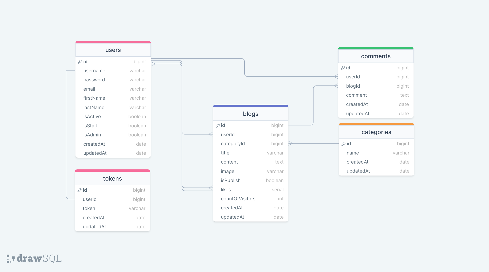

# BLOG API

[Backend_Link](https://blogapp-be-1bec.onrender.com)

### ERD:



### Folder/File Structure:

```
    .env
    .gitignore
    index.js
    package.json
    readme.md
    swaggerAutogen.js
    src/
        config/
            dbConnection.js
            swagger.json
        controllers/
            auth.js
            blog.js
            category.js
            comment.js
            token.js
            user.js
        errors/
            customError.js
        helpers/
            passwordEncrypt.js
            sendMail.js
            sync.js
        middlewares/
            authentication.js
            errorHandler.js
            logger.js
            permissions.js
            queryHandler.js
            upload.js
        models/
            blog.js
            category.js
            comment.js
            token.js
            user.js
        routes/
            auth.js
            blog.js
            category.js
            comment.js
            document.js
            index.js
            token.js
            user.js
```